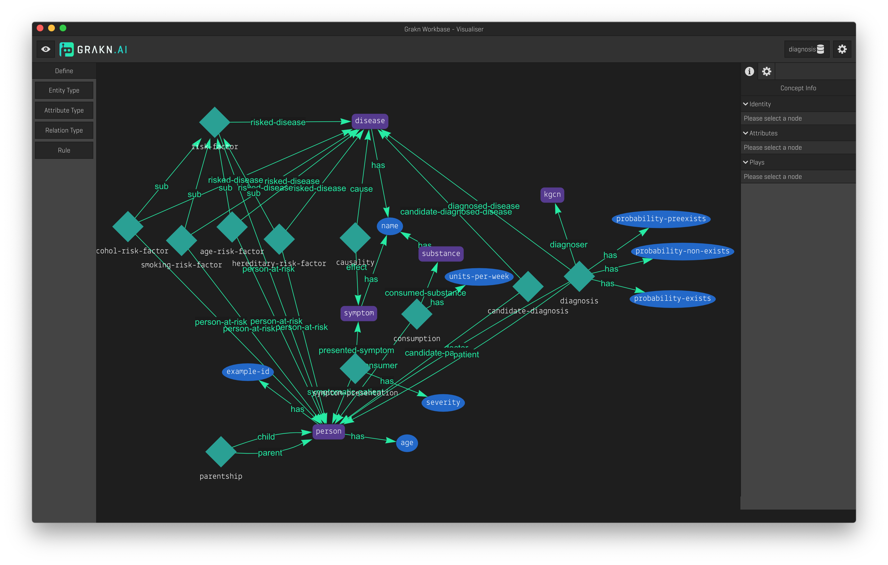
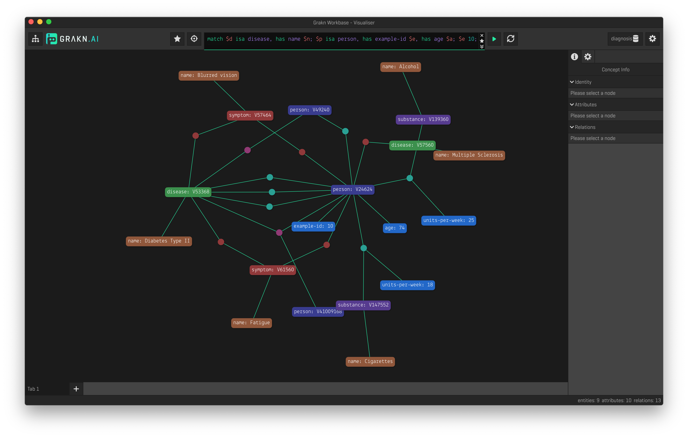

# KGCN Diagnosis Example

This example is entirely fabricated as a demonstration for how to construct a KGCN pipeline. Since the data for this example is generated synthetically, it also functions as a test platform for the KGCN model.

Studying the schema for this example, we have people who present symptoms, with some severity. Separately, we may know that certain symptoms can be caused by a disease. Lastly, people can be diagnosed with a disease.



## Running the Example

Once you have [installed KGLIB via pip](../../#getting-started---running-the-machine-learning-pipeline) you can run the example as follows:

1. Make sure a Grakn server is running

2. Load [the schema](../../../utils/grakn/synthetic/examples/diagnosis/schema.gql) for the example into Grakn. The template for the command is `./grakn console -k diagnosis -f path/to/schema.gql` for a locally running instance of Grakn. Add `-r <address>:<port>` to point to a remote/Grakn KGMS instance

3. Run the example: `python -m kglib.kgcn.examples.diagnosis.diagnosis`

   The whole example should complete in under 10 minutes

4. You should observe console output to indicate that the pipeline is running and that the model is learning. Afterwards two plots should be created to visualise the training process and examples of the predictions made.

## Diagnosis Pipeline

The process conducted by the example is as follows:

1. Generate synthetic graphs, each graph is used as an *example*
   - This requires specifying queries that will retrieve Concepts from Grakn
   - The answers from these queries are used to create subgraphs, stored in-memory as networkx graphs
2. Find the Types and Roles present in the schema. If any are not needed for learning then they should be excluded from the exhaustive list for better accuracy.
3. Run the pipeline
4. Write the predictions made to Grakn

## Relation Prediction

The learner predicts three classes for each graph element. These are:

```
[
Element already existed in the graph (we wish to ignore these elements),
Element does not exist in the graph,
Element does exist in the graph
]
```

In this way we perform relation prediction by proposing negative candidate relations (Grakn's rules help us with this). Then we train the learner to classify these negative candidates as **does not exist** and the correct relations as **does exist**.

## Results Output

### Console Reporting

During training, the console will output metrics for the performance on the training and test sets.

You should see output such as this for the diagnosis example:

```
# (iteration number), T (elapsed seconds), Ltr (training loss), Lge (test/generalization loss), Ctr (training fraction nodes/edges labeled correctly), Str (training fraction examples solved correctly), Cge (test/generalization fraction nodes/edges labeled correctly), Sge (test/generalization fraction examples solved correctly)
# 00000, T 9.3, Ltr 1.1901, Lge 1.0979, Ctr 0.5350, Str 0.1600, Cge 0.5000, Sge 0.0900
# 00020, T 19.5, Ltr 0.7894, Lge 0.7860, Ctr 0.5050, Str 0.0100, Cge 0.4350, Sge 0.0700
# 00040, T 22.8, Ltr 0.7248, Lge 0.7438, Ctr 0.6400, Str 0.4300, Cge 0.5250, Sge 0.3200
# 00060, T 26.0, Ltr 0.7091, Lge 0.7189, Ctr 0.6200, Str 0.5000, Cge 0.4800, Sge 0.4300
# 00080, T 29.1, Ltr 0.6837, Lge 0.6347, Ctr 0.7350, Str 0.7300, Cge 0.7250, Sge 0.7200
# 00100, T 32.2, Ltr 0.6551, Lge 0.6519, Ctr 0.7350, Str 0.7300, Cge 0.7250, Sge 0.7200
# 00120, T 35.3, Ltr 0.6438, Lge 0.6739, Ctr 0.7200, Str 0.6200, Cge 0.6850, Sge 0.6300
# 00140, T 38.5, Ltr 0.6478, Lge 0.6732, Ctr 0.7250, Str 0.6800, Cge 0.6450, Sge 0.4900
# 00160, T 41.6, Ltr 0.6162, Lge 0.6426, Ctr 0.7350, Str 0.7300, Cge 0.7200, Sge 0.7100
# 00180, T 44.7, Ltr 0.6110, Lge 0.6348, Ctr 0.7400, Str 0.7300, Cge 0.7200, Sge 0.7100
...
```

Take note of the key:

- \# - iteration number
- T - elapsed seconds
- Ltr - training loss
- Lge - test/generalization loss
- Ctr - training fraction nodes/edges labeled correctly
- Str - training fraction examples solved correctly
- Cge - test/generalization fraction nodes/edges labeled correctly
- Sge - test/generalization fraction examples solved correctly

The element we are most interested in is `Sge`, the proportion of subgraphs where all elements of the subgraph were classified correctly. This therefore represents an entirely correctly predicted example.

### Diagrams

#### Training Metrics

Upon running the example you will also get plots from matplotlib saved to your working directory.

You will see plots of metrics for the training process (training iteration on the x-axis) for the training set (solid line), and test set (dotted line). From left to right:

- The absolute loss across all of the elements in the dataset
- The fraction of all graph elements predicted correctly across the dataset
- The fraction of completely solved examples (subgraphs extracted from Grakn that are solved in full)


#### Visualise the Predictions

We also receive a plot of some of the predictions made on the test set. 


**Blue box:** Ground Truth 

- Preexisting (known) graph elements are shown in blue

- Relations and role edges that **should be predicted to exist** are shown in green

- Candidate relations and role edges that **should not be predicted to exist** are shown faintly in red

**Black boxes**: Model Predictions at certain message-passing steps

This uses the same colour scheme as above, but opacity indicates a probability given by the model.

These boxes shows the score assigned to the class **does exist**.

Therefore, for good predictions we want to see no blue elements, and for the red elements to fade out as more messages are passed, the green elements becoming more certain.

## How does Link Prediction work?

The methodology used for Relation prediction is as follows:

In this example, we aim to predict `diagnosis` Relations. We have the correct `diagnosis` relations, and we write a Grakn rule to insert `candidate-diagnosis` relations as negative targets. They are added wherever a real `diagnosis` Relation could logically exist, but does not.

We then teach the KGCN to distinguish between the positive and negative targets.

## Querying for the Train/Test Datasets

We do this by creating *examples*, where each example is a subgraph extracted from a Grakn knowledge Graph. These subgraphs contain positive and negative instances of the relation to be predicted.

A single subgraph is created by making multiple queries to Grakn. In this example, each subgraph centres around a `person` who is uniquely identifiable. This is important, since we want the results for these queries to return information about the vacinity of an individual. That is, we want information about a subgraph rather than the whole graph. 

In this example the queries used are:

```
match
$p isa person, has example-id 0;
$s isa symptom, has name $sn;
$d isa disease, has name $dn;
$sp(presented-symptom: $s, symptomatic-patient: $p) isa symptom-presentation;
$c(cause: $d, effect: $s) isa causality;
$diag(patient: $p, diagnosed-disease: $d) isa diagnosis;
get;
```

```
match
$p isa person, has example-id 0;
$s isa symptom, has name $sn;
$d isa disease, has name $dn;
$sp(presented-symptom: $s, symptomatic-patient: $p) isa symptom-presentation;
$c(cause: $d, effect: $s) isa causality;
$diag(candidate-patient: $p, candidate-diagnosed-disease: $d) isa candidate-diagnosis; 
get;
```

A single subgraph is extracted from Grakn by making these queries and combining the results into a graph. For your own domain you should find queries that will retrieve the most relevant information for the Relations you are trying to predict.

We can visualise such a subgraph by running these two queries one after the other in Grakn Workbase:



You can get the relevant version of Grakn Workbase from the Assets of the [latest Workbase release](https://github.com/graknlabs/workbase/releases/latest).

Using Workbase like this is a great way to understand the subgraphs that are actually being delivered to the KGCN -- a great debugging tool.

## Modifying the Example

If you need to customise the learning or model used for your own use case, you'll need to make changes to the [pipeline](https://github.com/graknlabs/kglib/tree/master/kglib/kgcn/pipeline/pipeline.py) used.

Consider tuning parameters and adjusting elements of the pipeline if you need to improve the accuracy that you see. Start by adjusting `num_processing_steps_tr`, `num_processing_steps_ge`, `num_training_iterations`.